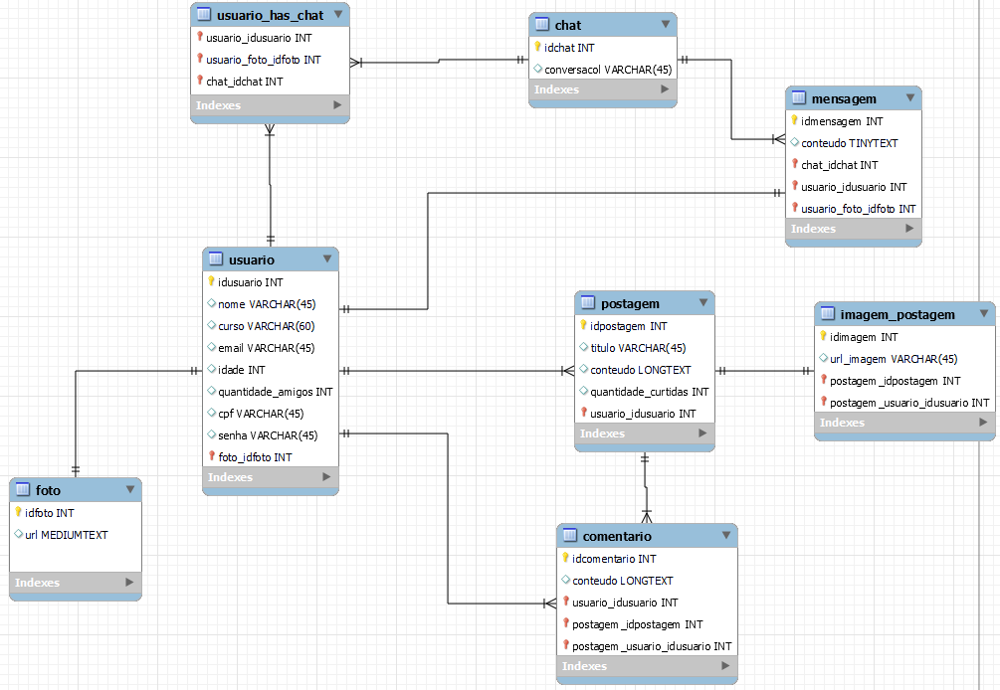

<h1> Documentação da modelagem do banco de dados. 
    
<h1/>
 

 

### Tabela Usuário 
  
- A tabela usuario é composta pelos atributos de ID usuário, Nome, Curso, E-mail, CPF, Idade e Senha ,Foto ID e Quantidade de Amigos.
 
- A tabela Usuário se comporta criando um ID único para cada usuário, e pedindo informações e a criação de uma senha, para o usuário criar sua conta.
  
- Relação úsuario é que tem mais relações e ela se relaciona diretamente com as tebelas Usuario_has_chat,foto,postagem, menssagem e comentário.

  
### Usuário has chat 

 - A tabela usuário tem chat, ela tem como Atributos ID usuário, chat_Idchat , usuário_foto_ID_foto.
    
- Esta tabela pega as informações das tabelas Usuário e Chat, para criar uma conversa entre o dono do perfil e entre outros usuários.

  
### Chat 
      
- A tabela chat, tem os atributos ID chat e conversacol.
      
- Esta tabela  se relaciona entre a tabela Usuário tem chat e a tabela Menssagem e faz o intermédio de conversas entre os usuários da rede social.

      
### Menssagem 
        
- A tabela menssagem recebe os atributos ID menssagem, conteudo,chat_ID_chat, usuárioID_usuário e usuario_foto_ID_foto.
        
- Esta tabela pega as informações da tabela Chat, Usuário e ela é basicamente o conteúdo dentro do chat entre os usuários que estão interagindo.

        
 ### Postagem 
          
- A tabela Postagem recebe os atributos ID Postagem,Título,conteúdo, quantidade de curtidas e ID usuário.
          
- Esta tabela se relaciona com a tabela Usuário, Comentário e Imagem Postagem.
          
- A tabela Postagem é sobre o as postagens entre os usuários.

          
### Imagem Postagem

 - A tabela Imagem Postagem recebe os atributos ID Imagem, URL Imagem,ID Postagem e Postagem usuário ID usuário.

 - Esta tabela se relaciona diretamente com a tebela Postagem e ela basicamente é sobre as imagens das postagens.

 

            
 ### Comentários

- A tabela Comentários recebe os atributos ID comentário, conteúdo, usuário ID usuário e postagem ID Psotagem.

-  Esta tabela se relaciona diretamente com a Postagem e a tabela Comentário é basicamente o contúdo de interação entre os usuários.

 

              
 ### Foto 

- A tabela Foto recebe os atributos ID foto e  Medium texto.

-  Esta tabela se relaciona diretamente com a tabela Usuário e esta tabela é sobre as imagens do dono do perfil.